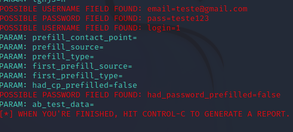

# Phishing para captura de senhas do Facebook

### Ferramentas

- Kali Linux
- setoolkit

### Configurando o Phishing no Kali Linux

- Acesso root: ``` sudo su ```
- Iniciando o setoolkit: ``` setoolkit ```
- Tipo de ataque: ``` Social-Engineering Attacks ```
- Vetor de ataque: ``` Web Site Attack Vectors ```
- Método de ataque: ```Credential Harvester Attack Method ```
- Método de ataque: ``` Site Cloner ```
- Própio setoolkit já disponibiliza seu ip aperte enter
- URL para clone: http://www.facebook.com
- Preferencialmente bote ou numa guia anonima ou numa maquina virtual para testar botando IP que foi colocado depois coloque o mesmo no campo de pesquisa de um navegador

### Resutados


